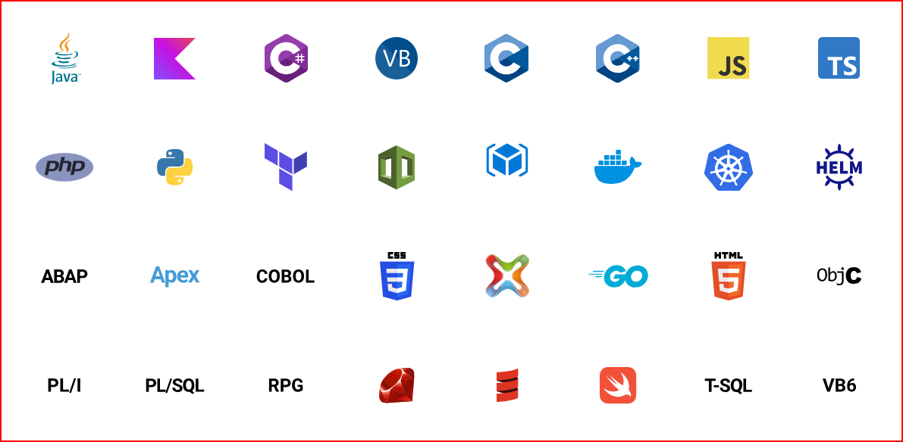

# SonarQube

    "Não há outra ferramenta no mercado que seja tão confiável e confiável quanto o SonarQube para Análise Estática. Eles são o padrão da indústria para análise de qualidade de software e devem fazer parte de qualquer empresa que exija auditorias sobre qualidade e vulnerabilidade de software."

    Daniel Anjos , avaliação da TrustRadius

Site oficial: https://www.sonarsource.com/products/sonarqube/

Cobertura para dezenas das linguagens, estruturas e plataformas IaC mais populares

## Características

- Detecção de Bugs

Detecta Bugs compicados ou pode apontar para um pedaço do código que ele acha que é defeituoso.

- Code Smells

Lembra o termo, "Não está me cheirando bem". Pode ser que o pedaço do código indicado tenha algum roblema ou venha causar algum problema no futuro.

- Vulnerabilidade de Segurança

    Exemplo, o desenvolvedor esquece de remover nome de usuário e senha que está estático no código para facilitar o desenvolvimento.

- Quality Profiles

    Regras customizadas onde é possível criar as próprias regras de detecção 

- Caminho de Execução

    O SonarQube irá procurar por problemas que possam estar ocultos no código relacionados 'as ligações entre os diferentes módulos da aplicação.

- Memory Leaks

    Detecta vazamento de memória

- Quality Gate

    Portão de qualidade, é configurado no SonarQube que o código é bom ou ruim com base nos requisitos e práticas.

## Instalação/Download

Requer o Java 11 

Windows x64 Installer

https://www.oracle.com/br/java/technologies/javase/jdk11-archive-downloads.html

SonarQube

https://www.sonarsource.com/products/sonarqube/downloads/

